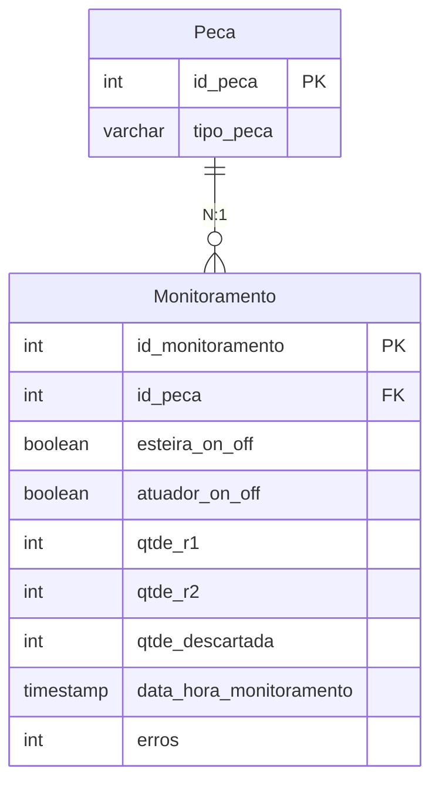

```mermaid
erDiagram

   Peca {
     int id_peca PK
     varchar tipo_peca
   }

   Monitoramento {
     int id_monitoramento PK
     int id_peca FK
     boolean esteira_on_off
     boolean atuador_on_off
     int qtde_r1
     int qtde_r2
     int qtde_descartada
     timestamp data_hora_monitoramento
     int erros
   }

   
   Peca ||--o{ Monitoramento : "N:1"
```