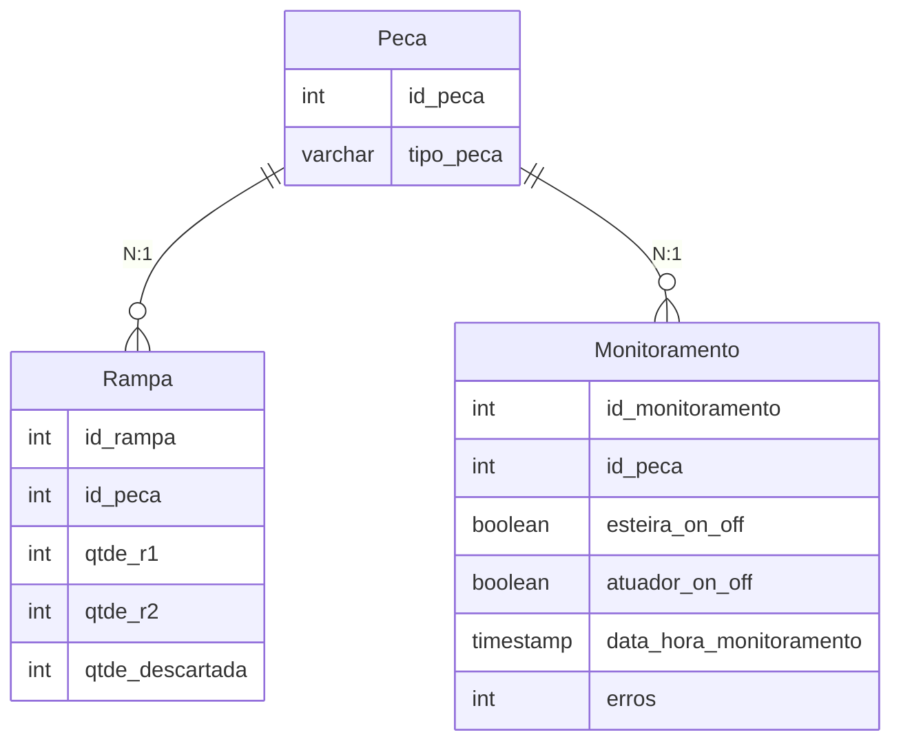

```mermaid
erDiagram
   Rampa {
     int id_rampa
     int id_peca
     int qtde_r1
     int qtde_r2
     int qtde_descartada
   }

   Peca {
     int id_peca
     varchar tipo_peca
   }

   Monitoramento {
     int id_monitoramento
     int id_peca
     boolean esteira_on_off
     boolean atuador_on_off
     timestamp data_hora_monitoramento
     int erros
   }

   Peca ||--o{ Rampa : "N:1"
   Peca ||--o{ Monitoramento : "N:1"
```